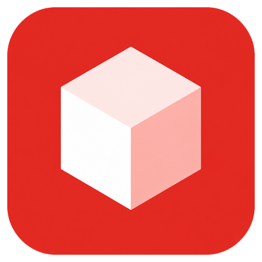
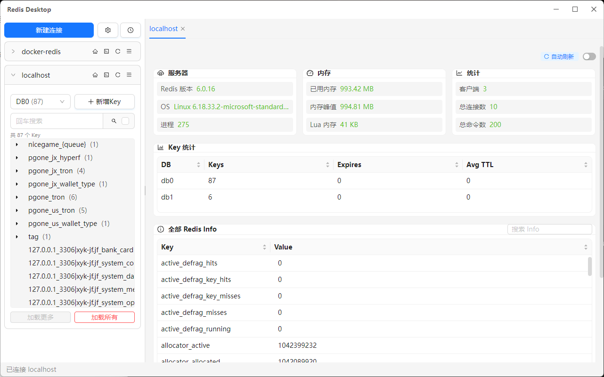
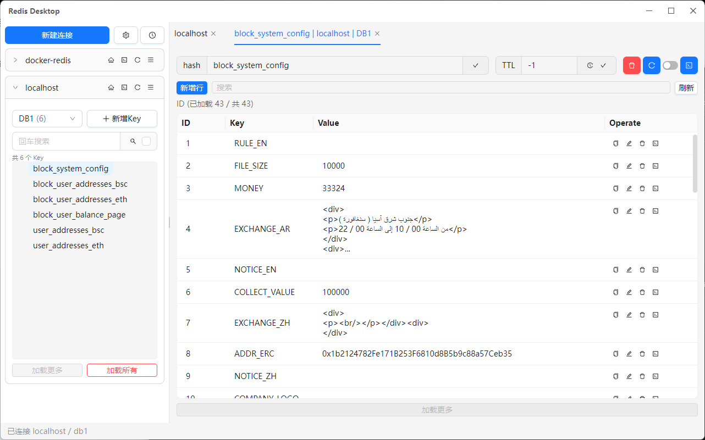
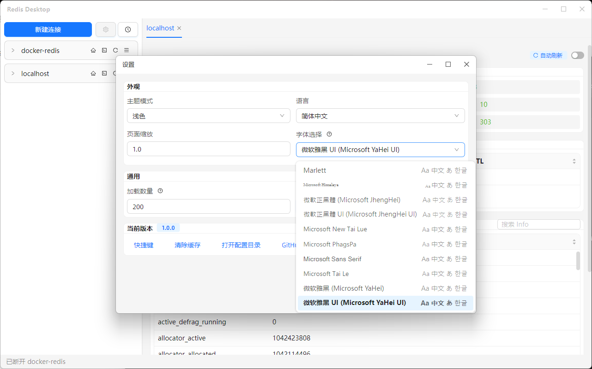

# Redis Desktop for AtomUI

<p align="center">
  
</p>

[English](README.md) | **简体中文**

原生 Redis 桌面客户端，用 [Avalonia](https://avaloniaui.net/) + [AtomUI](https://github.com/AtomUI/AtomUI) 构建，界面结构对标 [Another Redis Desktop Manager](https://github.com/qishibo/AnotherRedisDesktopManager)：左侧连接手风琴里浏览 Key，右侧 Tab 打开 Status、详情和 CLI。不是 Electron。

[](https://github.com/NiZerin/RedisDesktopForAtomUI/releases)
[](https://github.com/NiZerin/RedisDesktopForAtomUI/releases)
[](https://github.com/NiZerin/RedisDesktopForAtomUI/stargazers)


## 截图







## 下载

到 [Releases](https://github.com/NiZerin/RedisDesktopForAtomUI/releases/latest) 下载 `RedisDesktop-win-x64.zip`，解压后运行 `RedisDesktop.exe`。

- Windows 64 位自包含单文件，**不用安装 .NET**
- 首次启动可能稍慢（会解出 Skia 等原生库）
- 不是 NativeAOT / Trim 包，避免 Avalonia、AtomUI 被裁掉

macOS / Linux 可从源码自行 `dotnet publish`（见下方），暂无官方安装包。

## 功能

- **连接**：Standalone / Sentinel / Cluster，可选 SSL、SSH（含 Cluster + SSH 隧道）；分组、颜色、DB 别名；测试连接与心跳
- **Key**：默认 SCAN（不用 `KEYS *`）；树形或平铺；加载更多 / 全部；多项选择；新 Tab 打开
- **编辑**：String、Hash、List、Set、ZSet、Stream 分页增删改；TTL；只读连接禁用写入
- **Viewer**：Text / JSON / Hex / Gzip / Deflate / Brotli
- **Status**：INFO 首页（版本 / 内存 / 客户端 / Keyspace），可自动刷新
- **CLI / Pub/Sub / 命令日志**：历史与补全；订阅走独立 Tab；日志脱敏 `AUTH`，不记 `PING`
- **界面**：中 / 英；浅色 / 深色 / 跟随系统；缩放与字体；侧栏宽度退出后保持

## 使用

1. 「新建连接」填写 Host / 端口，选择 Standalone、Sentinel 或 Cluster，按需打开 SSL / SSH
2. 展开左侧连接。非 Cluster 用 DB 下拉切库，在连接内搜索、扫描 Key
3. 右侧打开 Status。点左侧 Key 打开详情 Tab；关 Tab **不会**断开，断开请用连接右键「断开」
4. 连接标题栏或右键打开 CLI / Pub/Sub；时钟按钮或 `Ctrl+G` 打开命令日志

| 快捷键 | 作用 |
|--------|------|
| `Ctrl+N` | 新建连接 |
| `Ctrl+,` | 设置 |
| `Ctrl+G` | 命令日志 |
| `Ctrl+/` | 快捷键表 |
| `Ctrl+L` | CLI 清屏 |
| `Ctrl` + 单击 Key | 在新 Tab 打开 |

配置目录：`%AppData%\RedisDesktopForAtomUI\`。密码和 SSH 口令用 Windows DPAPI 加密，不会明文写入 `connections.json`。导出的密文只在同一 Windows 用户下可解密。

## 连接注意

- **SSL**：填写 CA / 客户端证书。默认校验证书；跳过校验仅用于实验环境
- **Sentinel**：基础页填 Sentinel 的 Host/Port；Sentinel 页填 MasterName 与密码
- **Cluster**：Host 作种子，请填节点互相通告的地址，不要填只在本机有效的 `127.0.0.1`
- **SSH**：先保证 Standalone + SSH 能通。Cluster + SSH 会经隧道执行 `CLUSTER NODES`，再为每个 master 做本地转发

## 尚未包含

Slow Log、内存分析、RedisJSON / TimeSeries / Vector 专用编辑器、自定义脚本 Viewer、DUMP 批量导入导出、自动更新。CLI 目前是静态补全。`MONITOR` 已拒绝，订阅请用 Pub/Sub Tab。

## 从源码构建

需要 [.NET 8 SDK](https://dotnet.microsoft.com/download/dotnet/8.0)。

```bash
git clone https://github.com/NiZerin/RedisDesktopForAtomUI.git
cd RedisDesktopForAtomUI
dotnet run --project src/RedisDesktop.App
```

```bash
dotnet test
```

连不上本机 Redis 时，集成测试会跳过而不是失败。可用 `REDIS_TEST_HOST` / `REDIS_TEST_PORT` 覆盖测试地址。

### 自行打包

```bash
dotnet publish src/RedisDesktop.App/RedisDesktop.App.csproj -c Release -r win-x64 --self-contained true -p:PublishSingleFile=true -p:IncludeNativeLibrariesForSelfExtract=true -p:EnableCompressionInSingleFile=true -p:DebugType=None -p:DebugSymbols=false -p:CopyOutputSymbolsToPublishDirectory=false -o artifacts/win-x64
```

产物：`artifacts/win-x64/RedisDesktop.exe`。不要加 `PublishTrimmed` 或 `PublishAot`。其他平台把 `-r win-x64` 换成 `win-arm64`、`osx-arm64`、`osx-x64`、`linux-x64`。

## 致谢与许可

界面交互对标 [Another Redis Desktop Manager](https://github.com/qishibo/AnotherRedisDesktopManager)，实现未移植其 Electron / Vue 代码。UI 使用 [AtomUI OSS](https://github.com/AtomUI/AtomUI)（LGPL-3.0），仅通过 NuGet 引用官方二进制，未修改控件源码。
